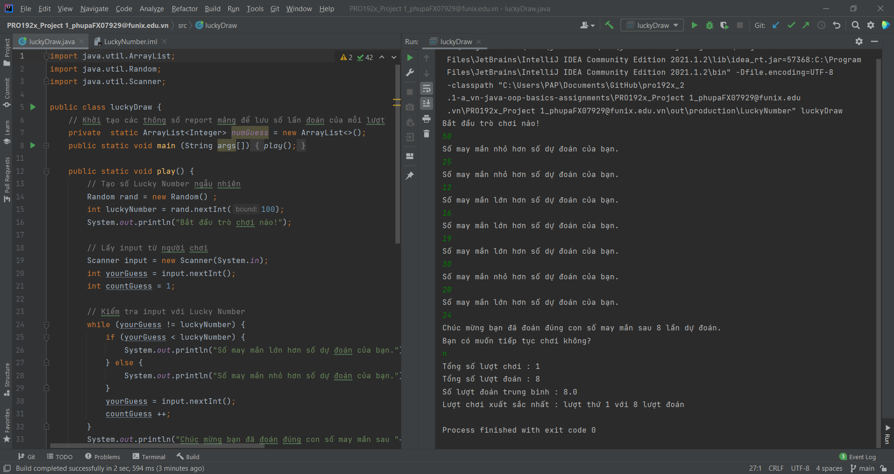

# pro192x_2.1-a_vn-java-oop-basics-luckynumber

 This folder contains my submission to the assignment `Lucky Number` in the course PRO192x_2.1-A_VN (Object-Oriented Programming with Java), a part of the path Software Engineering provided by FUNiX.

## About the project

- The project is a simple game to guess the lucky number - which is previously generated and kept secret, and the project covers Java basics and OOP (the UI is just simple print-outs on console):  use Math.random() for random generator, control flow with if-else, variables and expressions in Java, printing out in console, loops in Java.

- **Keyword**: _Java basics, collections, object-oriented programming, OOP_.

## Functional description

<a href="PRO192x_Project 1_phupaFX07929@funix.edu.vn">_**Lucky number**_</a>  has some following features:
  - Generate a random number (this is so-called _Lucky Number_) which is between 0 and 100.
  - User inputs his guess and then print out the console **_"số may mắn nhỏ hơn số dự đoán của bạn"_** if the lucky number is **less** than the user's guess; _**"số may mắn lớn hơn số dự đoán của bạn"**_ if the lucky number is greater than the user's guess; "**_chúc mừng bạn đã đoán đúng con số may mắn sau x lần dự đoán"_** if the user gives the right guess (with x is the number of guesses)
  - The guess ends up with the question whether user would like to continue a new turn of guess or not. If yes, continue a new cycle of above steps. Otherwise, report with the total of plays, the total of guess, the average number of guesses per lucky number and the best play. **_Notes:_** the program should handle well with different type of "Yes" and "No" (such as "Y", "y", "yES", "n", "nO", etc.)

## Demo

- The demo of <a href="PRO192x_Project 1_phupaFX07929@funix.edu.vn">_**Lucky number**_</a> can be seen via https://www.youtube.com/watch?v=oEKnCvus414

## Further enhancement
- Add UI with JavaFX or Java Swing for better user interaction.
